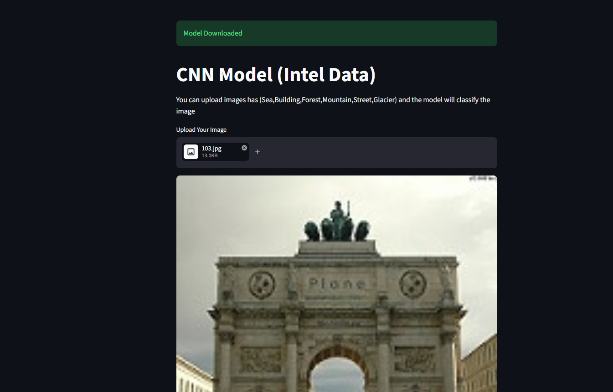
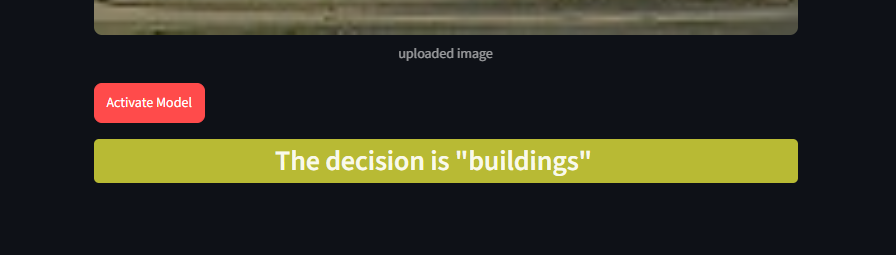
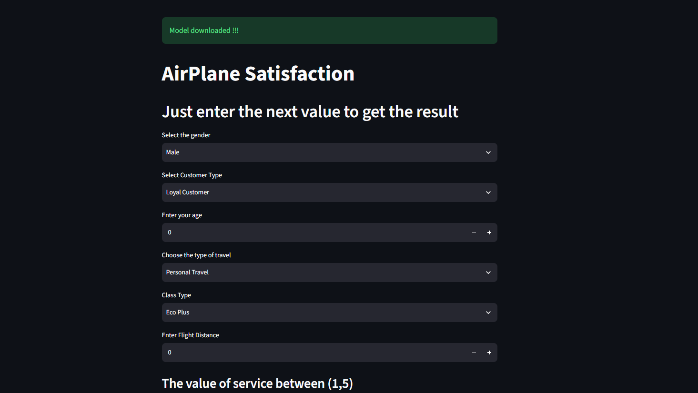
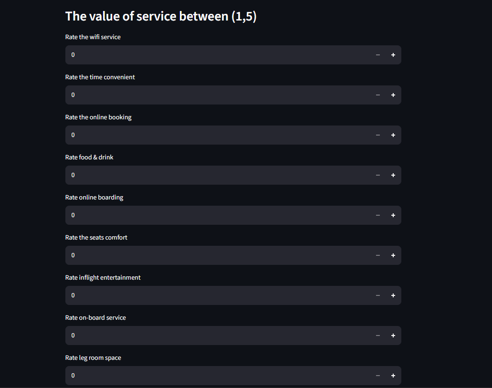

# Intel Data Set

This project is trained on intel data set. I got this data from Kaggle.
I trained CNN model from scratch but the accuracy was not good. So I have used transfer learning to increase the accuracy and this step was approved. 

# Airplane Data Set

I get this data set from kaggle. I have trained model to detect if the customer is satisfaied or not after the journey. and that help the company to increase or improve their services and all of that come from fill in the inputs in the website to see the detiction. After the detection you will see a button that present the issue or the point of weakness of the company supported by two graphs.

## How to Use

#### Model One :

- just upload image you want to classify it if this photo is (Building, Forest, Sea, Glacier, Mountain, Street)

- Click the button of "ACtivate the model"

- Wait for the final decision of the model

#### Model Two :

- just fill the inputs areas by the values you want to enter
- Click on the "Activate" to sea the result

## Test My Models by accurate way

- "Airplane" you can see test.csv and fill in the areas and compare the result of the model

- "Intel" You can get image from internet or from  intel/seg_pred/seg_pred/ then choose any image

## Installation 

- No installation needed
- just open the link of the demo and show the demo

## Data Set

- I get this Data from kaggle

## Features

- I have used Tensorflow , Scikit-Learn, numpy, pandas, streamlit, pillow
- I used tensorflow to create Conv2d , Dense, Avrage Max pool , DataAugmentation layers 
- I used scikit learn to add some features like split and do the test to see the accuracy of model
- I used numpy to create an array can enter the model or modify it
- I used pandas to know if the data is balance or not
- pillow for read or open the image

# Screen Shots

